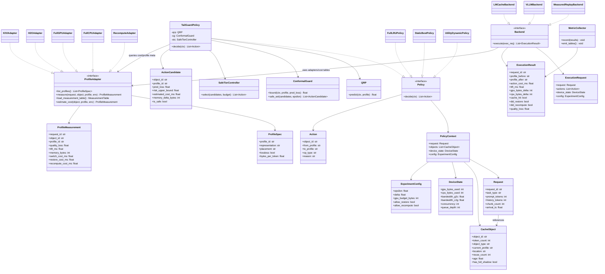
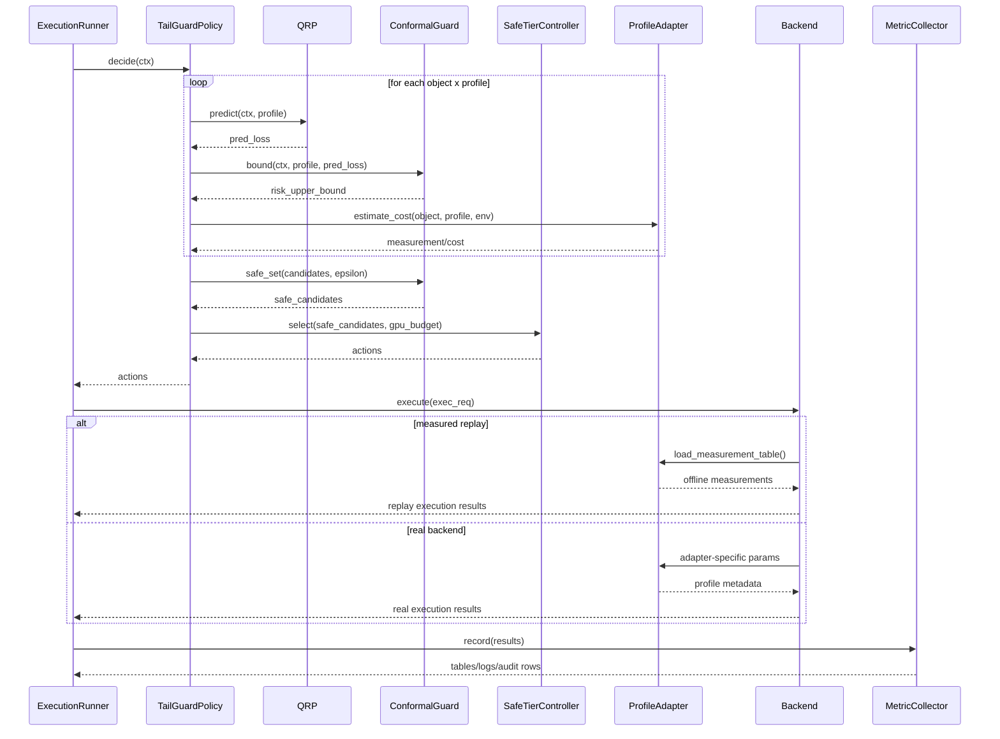

# TailGuardKV 实验设计总结

本文基于 [王祯祥_论文工作规划.md](./王祯祥_论文工作规划.md) 整理，面向项目内部汇报使用。重点不是逐段复述原文，而是把当前方向的研究背景、问题定义、方法框架和实验设计收拢成一份可以直接阅读的说明。

## 1. 研究背景

TailGuardKV 关注的是边缘大模型服务里的 KV cache 管理问题。这个问题的现实背景并不复杂：上下文一长，KV cache 很快就会吃掉大量显存；一旦负载上来，TTFT、显存峰值和 OOM 风险都会跟着上升。对边缘设备来说，这个矛盾更尖锐，因为可用显存小，带宽不稳定，并发波动也大。

过去几年，围绕这个问题已经出现了很多成熟方案。KIVI、KVQuant 代表的是量化路线，H2O、SnapKV、PyramidKV 更偏向剪枝和重要性保留，vLLM、LMCache、CachedAttention、Mooncake 等工作则把重心放在分页缓存、跨层放置和 GPU/CPU 协同管理上。再往前一步，AdaptCache、KVServe、TTKV、MorphServe、SparKV 这些新工作已经把 profile 选择、设备放置、系统状态和质量预算结合起来做在线决策。

也正因为前面的工作已经铺得很满，这个项目在 2026 年 7 月做了一次方向重构。原来那条“多精度 × 多层放置”的主线不再够新，单独的 LPE 换出策略也被预实验否掉了。新的切入点不再是“动作更复杂”，而是“约束更可信”。规划文档把问题重新收束到一件更接近真实部署的事情上：现有系统大多报告平均质量、平均延迟，或者固定 profile 下的平均预算，但很少回答“某条请求在采用近似 KV 之后，质量损失超过阈值的概率到底是多少”。

这就是 TailGuardKV 的研究背景。它不是再发明一种新的量化核，也不是再做一套新的分层缓存机制，而是试图把“尾部质量风险”放进 KV 管理的中心位置。

## 2. 动机与难点

这个方向的直接动机来自一个很常见、但以前经常被平均指标掩盖的问题。两个策略平均质量都只下降 1%，表面上看差距不大；可一种情况可能是所有请求都轻微退化，另一种情况可能是 95% 的请求几乎无损，另外 5% 直接出严重错误。对论文表格来说，这两者的均值可能差不多；对真实服务来说，后者更危险，尤其是在问答、代码生成、长会话和 RAG 场景里，少量灾难性错误会直接伤到用户体验。

所以 TailGuardKV 想解决的不是“平均质量要不要更高”，而是“在显存和时延压力下，系统能不能只选那些质量风险可控的动作”。规划文档把这个要求明确写成了质量 SLO：给定单请求可接受损失阈值 `epsilon` 和允许超阈值的最大比例 `delta`，系统应当把质量违例率控制在 `delta` 以内，再在这个前提下去优化 p95 TTFT 和显存占用。

难点主要有四个。

第一，系统做决策时看不到 full-KV 的真实结果。也就是说，动作是在“没有答案的时候”选出来的，风险判断只能依赖决策时可见的特征，而不能依赖事后真值。

第二，动作不是单一 profile 的静态选择，而是在多个 profile 之间自适应切换。只要控制器会动态选动作，很多单 profile 的平均统计就不再可靠。每个动作分别看起来都安全，不代表组合后的整体行为仍然安全。

第三，边缘场景里的 workload shift 很常见。任务类型、上下文长度、复用率、并发和带宽都会变化。离线校准一次并不等于线上长期有效，系统需要能在漂移后恢复 coverage。

第四，项目不能靠“全部回退到 full-KV”来获得漂亮的安全指标。只要全用精确动作，质量自然最稳，但系统收益也基本没有了。TailGuardKV 最终要同时证明两件事：质量约束守住了，而且在这个约束下仍然能换来 TTFT 或显存上的实际收益。

## 3. 主要贡献

按照当前规划，TailGuardKV 的主要贡献可以归纳为四项。

第一，项目把 KV cache 管理重新定义成一个带尾部质量约束的在线控制问题，而不是传统的“平均质量损失 + 系统代价”的加权优化。这个变化不只是换了个公式，而是把评估标准一起改了。后续实验不能只报平均质量，还必须报 q95/q99 loss、违例率、worst-group risk 和 p95 TTFT。

第二，项目引入了经校准的质量风险守门机制。系统不会直接相信某个预测器给出的点估计，而是把预测损失进一步转换成风险上界。这样做的目的很明确：点预测只能说明“看起来可能没事”，风险上界才接近“在当前数据条件下，这个动作大概率仍在可接受范围内”。

第三，项目设计了一个风险安全的动作控制器。控制器不再在所有动作里直接比谁收益最大，而是先把不安全动作排除掉，只在安全集合里做压缩、剪枝、GPU/CPU 放置和精确 fallback 的决策。这样质量约束和系统优化就被分成了两层，边界比较清楚。

第四，项目把漂移问题放进了系统闭环里。线上工作负载变了，先前的校准阈值可能不再可靠。TailGuardKV 不假设这种问题不会发生，而是用 shadow audit 去监控和修正它。这个闭环最后要回答的是：在 workload shift 后，系统多久能把违例率重新拉回目标范围，代价又有多大。

从汇报角度看，最好把这四点讲成一句完整的话：TailGuardKV 的新意不在动作空间本身，而在于它试图把“可校准、可审计、可恢复的尾部质量控制”接进现有 KV 管理系统里。

## 4. 问题建模

这部分在原始规划里定义得比较完整，适合直接拿来说明项目不是泛泛而谈。

系统面对的是一组请求 `i`。每个请求可能关联若干可复用 KV 对象 `o`，例如 prefix cache、RAG 中间状态或会话历史。系统可选的表示与放置方式统一记为动作 `a`，也就是 profile。为了做校准和分组统计，文档还定义了任务组 `g(i)`，通常按任务类型和上下文长度预先划分。

当前阶段的初始动作空间不算大，主要包括：

- `full@GPU`
- `KIVI4@GPU`
- `KIVI2@GPU`
- `pruned50@GPU`
- `full@CPU`
- `recompute`

这个动作空间足以覆盖精确保留、有损压缩、跨设备放置和精确回退四类行为。规划里特意强调，Pilot 阶段先用小而完整的动作空间跑通闭环，等系统稳定后再逐步扩大。

质量损失定义为相对 full-KV 的归一化有界损失：

```math
\ell_i(a)=\operatorname{clip}\left(\frac{Q_i^{full}-Q_i^a}{\max(|Q_i^{full}|,\tau)},0,1\right)
```

其中，`Q_i^{full}` 是请求 `i` 在 full-KV 下的任务得分，`Q_i^a` 是采用动作 `a` 时的得分。不同任务使用各自对应的原始指标：QA 和 RAG 用 EM 或 F1，摘要用 ROUGE-L，代码任务用 pass/fail 或单测通过率。没有标准答案的指标，例如 token agreement 或 logit KL，只能作为辅助分析，不能替代任务质量本身。

项目真正想守住的是下面这个质量 SLO：

```math
\Pr[\ell_i(a_i)>\varepsilon]\le\delta
```

这里：

- `epsilon` 表示单请求可接受的质量损失阈值；
- `delta` 表示允许超过该阈值的最大比例。

也就是说，系统的目标不再是“平均损失尽量小”，而是“超出阈值的请求比例不能超过 `delta`”。

资源约束同样写得很清楚。对任意时刻，所有对象占用的总显存不能超过预算；同时动作迁移必须满足真实系统可执行的有效迁移图。例如，`full -> quant` 可以直接发生，但 `quant -> full` 不能凭空升级，只能依赖保留的 full shadow 或精确重算。这一点看上去像工程细节，其实很重要，因为它决定了后面的控制器不会写出物理上做不到的动作。

最终优化目标是在这些约束下，最小化 TTFT 的尾部代价，以及迁移和审计带来的额外成本。原文把它写成 CVaR 形式的目标函数，核心意思很直白：在守住质量 SLO 和显存预算的前提下，尽量降低系统尾部时延。

## 5. 整体框架

这部分需要分成两个层次来看。一个是 TailGuardKV 本身的方法框架，解决“系统怎么做决策”；另一个是实验框架，解决“这套系统怎么被公平地验证”。两者不能混在一起讲。

### 5.1 TailGuardKV 方法框架

TailGuardKV 的方法框架由四个模块组成：

- QRP：Quality Risk Profiler
- CG：Conformal Guard
- STC：Safe Tier Controller
- AAL：Audit & Adaptation Loop

它们的关系如下：

```text
请求 / 可复用 KV 对象
        |
        v
QRP：提取决策时特征，预测每个 profile 的质量损失
        |
        v
CG：基于 calibration residual 做 conformal 校准，得到风险上界 U(x,a)
        |
        v
安全集合 A_safe = {a | U(x,a) <= epsilon} ∪ 精确动作
        |
        v
STC：在安全集合内，结合显存预算、迁移代价、恢复代价、重算代价选动作
        |
        +--> full@GPU
        +--> quant/pruned@GPU
        +--> full@CPU restore
        +--> recompute
        |
        v
AAL：抽样审计 -> full reference -> coverage 检查 -> 漂移检测 -> 阈值更新
```

QRP 负责在决策时根据请求、对象和系统状态估计每个 profile 可能带来的质量损失。CG 不直接选动作，它做的是把点预测转换成校准后的风险上界，并筛出安全动作集合。STC 再在这个集合里做系统层面的成本选择。如果所有有损动作都不安全，就退回无损动作，例如 `full@CPU` 或 `recompute`。最后，AAL 通过少量 shadow audit 监控线上覆盖率和漂移情况，必要时更新阈值、提高 audit rate 或封禁失准 profile。

这个框架的重点不在“模块很多”，而在“先校准风险，再做优化，最后还能闭环恢复”。如果只做前两步，系统很容易在 workload shift 后失效。

### 5.2 实验框架

实验框架的目标是把 TailGuardKV 和所有 baseline 放进同一套执行和评估管线里，避免每种方法用一套不同脚本，最后结果不可比。

整体结构可以画成下面这样：

```text
Workload / Trace / Config
        |
        v
ProfileAdapter
(Full / KIVI / H2O-SnapKV / CPU Offload / Recompute)
        |
        v
Backend Layer
(Measured Replay / vLLM / LMCache)
        |
        v
Policy Layer
(full_lru / static_best / utility_dynamic / uncalibrated / tailguard / oracle)
        |
        v
Execution Runner
(统一调度、统一随机种子、统一预算与SLO、统一重复次数)
        |
        v
MetricCollector
(质量 / 系统 / 校准 / 漂移 四类指标)
        |
        v
Result Tables / Figures / Logs / Audit Records
```

这套框架里真正要讲清楚的，不只是“有哪些模块”，而是三层边界：`ProfileAdapter` 负责把不同 profile 做成统一动作接口，`Policy` 负责在当前状态下选动作，`Backend` 负责把动作在具体系统里执行出来。三层分清以后，TailGuardKV 和 baseline 才能放进同一条实验管线里公平比较。

#### ProfileAdapter 层做什么

`ProfileAdapter` 处理的是动作空间本身。文档里把 profile 定义成对象的表示、放置和恢复方式，初始动作空间包括 `full@GPU`、`KIVI4@GPU`、`KIVI2@GPU`、`pruned50@GPU`、`full@CPU` 和 `recompute`。这一层的任务，不是决定该选哪个 profile，而是把这些动作封装成统一接口，并为上层提供可比较的数据。

它至少做三件事：

- 统一封装不同 profile 的执行入口，屏蔽 KIVI、H2O/SnapKV、CPU offload 和 recompute 在底层实现上的差异；
- 实际运行或测量这些 profile，产出每请求 × profile 的质量、显存和延迟数据；
- 把这些结果整理成标准化表格，供 QRP 训练、CG 校准和 measured-replay backend 回放使用。

这层的输入主要有三类：请求和对象信息，例如任务类型、对象 token 数、上下文长度和是否可复用；profile 标识，也就是“要把这个对象变成什么表示和放置方式”；执行环境信息，例如设备类型、batch、并发和带宽，这些量会影响量化、恢复和重算代价。

它的输出不是策略结论，而是动作后果。最核心的产物是每请求 × profile 的质量、延迟、显存表，以及与 profile 切换相关的成本数据，例如 bytes/token、量化时间、restore 时间和 recompute 时间。上层并不直接碰各家 kernel，而是通过这层拿到“这个 profile 真跑起来会是什么样”。

所以 `ProfileAdapter` 回答的问题是：如果把同一个对象变成不同 profile，各自会带来什么真实后果。

#### Policy 层做什么

`Policy` 是决策层。它负责根据当前请求、对象状态、缓存状态和设备状态，选出一个具体动作交给 `Backend` 执行。所有 baseline 和 TailGuardKV 主方法都应该挂在这一层上，这样同一 runner 才能公平比较不同策略。

它的输入一般包括：请求信息，例如任务类型、prompt 长度、上下文长度、历史长度、RAG chunk 数和到达时间；对象信息，例如对象 token 数、当前 profile、当前位置、age、reuse 次数和是否保留 full shadow；系统状态，例如当前 GPU/CPU 占用、剩余预算、并发、队列状态和带宽估计；以及策略依赖的辅助量，例如 QRP 预测损失、CG 风险上界、reuse 概率和切换成本预测。

它的输出是一个明确动作，例如把某个对象从 `full@GPU` 切到 `KIVI4@GPU`，把某个对象切到 `pruned50@GPU`，把某个对象 offload 到 `full@CPU`，或者直接丢弃并在后续访问时 `recompute`。

不同策略得到动作的方式不同。`full_lru` 基本不做质量预测，默认全精度，显存超限时按 LRU 或引擎默认规则换出；`static_best` 和 `static_safe` 先离线选出固定 profile，线上按固定规则执行；`utility_dynamic` 根据平均质量和系统收益构造 utility 分数；`uncalibrated_dynamic` 利用预测损失，但不做 conformal 校准；`tailguard` 则先经 QRP 预测，再经 CG 生成安全集合，最后由 STC 在安全集合里做成本优化。

对 TailGuardKV 来说，这一层内部其实是一条三段式决策链：QRP 先预测每个 profile 的质量损失，CG 再把点预测变成风险上界并筛出安全 profile，最后 STC 只在安全集合里做系统成本优化，必要时退回 `full@CPU` 或 `recompute`。

所以 `Policy` 回答的问题是：在当前状态下，系统应该做什么。

#### Backend 层做什么

`Backend` 是执行层。它不决定该选什么动作，只负责在当前环境里真正执行动作，并返回动作执行后的系统结果。换句话说，`Policy` 给它一个动作，`Backend` 把这个动作落到具体系统上，再把后果量出来。

它主要做三件事：

- 维护底层运行时状态，包括 GPU/CPU cache 状态、对象当前位置、profile、带宽和并发信息；
- 执行上层给出的动作，例如压缩、剪枝、offload、restore、drop 或 recompute；
- 返回这次动作带来的真实结果，包括动作耗时、显存变化、TTFT 变化、是否触发 restore/recompute，以及在 replay 或 shadow 模式下对应的质量信息。

`Backend` 的输入通常包括：当前请求或当前对象；当前 cache state 和 device state；实验配置，例如显存预算、带宽设定和是否允许某类迁移；上层 `Policy` 给出的明确动作；以及来自 `ProfileAdapter` 的 profile 执行参数和成本表。

它的输出是执行结果，而不是策略判断。至少要包含动作是否成功执行、执行后的 profile 和位置、动作代价、请求 TTFT、GPU/CPU 内存变化、是否发生 restore 或 recompute，以及在 replay 或 audit 模式下可关联的质量结果。

输出的来源取决于 backend 类型。`Measured-Replay Backend` 不需要每次都真实跑完整模型，而是基于预先测好的 profile 数据和 trace 回放；`VLLMBackend` 或 `LMCacheBackend` 这类真实系统 backend 则直接操作真实推理系统，动作代价、TTFT、显存变化和 restore/offload 行为都来自实时测量。

所以 `Backend` 回答的问题是：如果上层真的这样做了，系统会发生什么。

下面这两张图把三层接口和一次完整调用链压缩成近代码草图。正文负责交代边界，图负责把接口关系画清楚。

#### 类图



这张图里有三个关键边界。第一，`ProfileAdapter` 不做决策，只提供 profile 定义、测量结果和成本估计。第二，`Policy` 不直接碰底层 kernel，它只消费 `ProfileAdapter` 给出的 profile 信息，然后产出 `Action`。第三，`Backend` 不重新决定动作，它只负责把 `Action` 落到 replay 或真实系统上，并返回 `ExecutionResult`。

#### 时序图



如果把这个调用链翻回正文，可以压成一句话：Runner 先把上下文交给 `Policy`，`Policy` 结合 QRP、CG、STC 和 `ProfileAdapter` 选出动作，`Backend` 再执行这些动作，最后由 `MetricCollector` 统一记账。这也是后续代码结构最稳妥的落点。

## 6. 核心方法

TailGuardKV 的核心方法可以按四个模块展开。它们和前面的整体框架是一一对应的，只是这里更强调每个模块具体在做什么。

### 6.1 QRP：Quality Risk Profiler

QRP 的任务是在动作发生前，对每个候选 profile 预测质量损失。它使用的特征分三组。

第一组是零成本元数据，例如任务类型、prompt 长度、历史长度、chunk 数、profile 类型、复用次数。这些特征最便宜，也最容易稳定获得。

第二组是低成本模型信号，例如部分层 attention entropy、top-k mass、首 token logit margin。它们会增加一些测量成本，但能帮助识别哪些请求对近似 KV 更敏感。

第三组是系统状态，比如当前显存占用、带宽、并发和缓存年龄。文档里特别提醒，这些特征更适合用于成本预测，不能混淆成质量真值本身。

QRP 当前阶段倾向使用 LightGBM 或小型 MLP。重点不是把 predictor 做得多复杂，而是让它足够轻量、足够稳定，并且输出能被后续校准。文档也明确说明，MAE、AUC 只能作为辅助指标，真正重要的是校准后 coverage 能不能守住、安全 profile 的可用率够不够高。

### 6.2 CG：Conformal Guard

CG 的作用是把 QRP 的点预测变成风险上界。系统不会直接拿 `hat_loss` 去和 `epsilon` 做比较，而是先在 calibration set 上计算残差，再为每个 group-profile 组合取单边分位数，形成保守修正项。

对新请求和动作 `a`，CG 输出：

```math
U_i(a)=\hat\ell_i(a)+q_{g(i),a}
```

只有当 `U_i(a) <= epsilon` 时，动作 `a` 才能进入安全集合。

这一层最关键的地方在于，TailGuardKV 面对的是多动作自适应选择，不是单 profile 静态判断。因此文档采用了 simultaneous calibration，把总风险预算 `delta` 分配到不同动作上，保证控制器最后从多个动作里选时，整体违例率仍然可控。Pilot 阶段先采用平均分配，主实验再比较更细的风险预算方案。

如果某个 group-profile 的样本量不够，CG 不能假装自己有保证。规划里的处理方式是逐层放宽校准池：先从 `任务 × 长度 × profile` 放宽到 `任务 × profile`，再到 `profile-global`；实在不够，就直接把该有损动作标为 unsafe。这种保守处理是必要的，因为 TailGuardKV 的核心卖点之一就是“不要伪造保证”。

### 6.3 STC：Safe Tier Controller

STC 在安全集合里做系统代价最小化。它拿到的是 CG 过滤后的安全动作，然后结合对象当前状态、显存预算和预测成本，决定具体该执行哪个动作。

成本建模里涉及几个量：

- 动作能释放多少显存；
- 从当前状态迁移到目标 profile 的切换成本；
- 未来再次访问该对象时的 restore 成本或 recompute 成本；
- 未来窗口内对象被再次访问的概率；
- 并发和排队带来的尾部时延附加代价。

在显存不足时，STC 会为每个安全动作计算“释放单位显存所需付出的保守延迟代价”，再按这个比值做贪心选择，直到满足显存预算。如果贪心选完仍然不够，就进入 exact fallback。规划里还安排了一个小 trace 上的 offline ILP oracle，用来衡量这个贪心策略离离线最优解有多远。

这部分还有三个工程边界很重要。

第一，有损状态不能凭空恢复成精确状态，除非 full shadow 还在，或者系统愿意做一次精确重算。

第二，同 profile 内的普通换出使用 LRU 或引擎默认策略，不再把 LPE 一类新换出分数当作创新点。

第三，控制器要用 hysteresis 和最小驻留时间抑制 profile 来回抖动，否则系统可能因为频繁切换而把节省的那点时延又花回去。

### 6.4 AAL：Audit & Adaptation Loop

AAL 处理的是 deployment 之后的问题。即使离线阶段校准做得不错，线上 workload 变化后，风险上界和成本模型也可能一起漂。

规划文档把漂移分成四类：workload/covariate drift、quality/concept drift、reuse drift、system-cost drift。AAL 不是一看到分布变了就全面重训，而是先通过 audit 抓真实标签，再判断到底是哪一层出了问题。

它的基本流程是：

1. 按 `(group, selected_profile)` 分层抽样请求做 shadow audit；
2. 保留当前 profile 的输出，同时异步跑 full-KV reference；
3. 计算真实质量损失、violation 和 residual；
4. 维护整体及分组的 Wilson 区间、CUSUM 或 Page-Hinkley 统计；
5. 一旦发现 coverage 连续超标，就更新 quantile、提高 audit rate、暂时禁用高风险动作；
6. 如果问题持续，再重训 QRP 或更新成本模型。

这里最值得汇报的一点是：AAL 的目标不是把系统改造成“永远不会漂移”，而是把 drift 后的恢复过程显式化、可测量。最后要看的指标不是“有没有 drift”，而是“多少 audited samples 能把违例率拉回目标区间”、“audit rate 要升到多少”、“恢复期间的系统代价有多大”。

## 7. 实验设置

实验设置部分是整个规划里很硬的一块，因为它决定最后结论能不能站住。

### 7.1 平台

实验平台分三个层次。

第一层是开发和标定平台，使用 1 台服务器 GPU，固定 CUDA、vLLM、LMCache、Transformers 版本。这一层主要用于 profile 测量、成本建模、QRP 校准和 measured replay。

第二层是受限显存平台，本质上还是同一台 GPU，但人为设置至少三档显存预算，用来模拟不同资源压力。这一层对 TailGuardKV 很重要，因为如果预算不紧，profile 选择就没有意义，控制器也难以体现价值。

第三层是端侧平台，目标设备是 Jetson Orin 或同等级受限 GPU。规划文档写得很清楚：如果最终没有完成端侧或同等级受限设备验证，H4 不能算通过。

### 7.2 模型与工作负载

模型至少包括两个：

- `Qwen2.5-7B-Instruct`
- `Llama-3.1-8B-Instruct`

最终版本还计划补一个不同架构或不同规模模型，避免结论只依赖单一模型特性。

工作负载分四类：

1. `LongBench`
   覆盖 QA、摘要、代码三种任务类型，用来测试不同任务对近似 KV 的敏感性是否一致。

2. `RAG`
   强调多 chunk、共享知识、冷热变化，适合暴露 cache reuse、对象迁移和质量退化之间的关系。

3. `ShareGPT`
   用于多轮会话与 prefix 复用，能够检验 session 场景下的对象生命周期和 profile 切换行为。

4. `Shift 场景`
   主动改变任务比例、上下文长度、复用率、并发和带宽，用来评估 AAL 的恢复能力。

每个实验点都要固定 trace、到达顺序、模型和随机种子，并至少重复 3 次。主结果要求报告 95% 置信区间。

### 7.3 Baseline

当前规划要求同时实现以下 baseline：

- `full_lru`：全精度 + 引擎默认换出
- `static_best`：满足平均质量约束的最佳固定 profile
- `static_safe`：满足 tail SLO 的最保守固定 profile
- `utility_dynamic`：AdaptCache 风格的平均 quality-utility 控制器
- `uncalibrated_dynamic`：使用点预测阈值、不做 conformal
- `tailguard`：QRP + CG + STC + exact fallback
- `quality_oracle`：只作上界，不参与可部署 baseline 排名

另外，小 trace 上还要用 `offline_ilp` 或类似 oracle 比较 STC 的 optimality gap。

这里有一条很现实的要求：如果直接竞品没有开源代码，实验中就必须把复现依据、缺失机制和可能偏差写清楚，不能把一个弱化版随便命名成原论文方法。

### 7.4 指标

实验指标分四组。

1. 质量指标

- mean loss
- q95 / q99 loss
- violation rate
- CVaR
- worst-group violation

2. 系统指标

- TTFT
- p95 TTFT
- 峰值显存
- 动作分布
- controller 开销

3. 校准指标

- target vs empirical coverage
- group coverage
- bound slack
- exact fallback ratio

4. 漂移指标

- drift 后恢复到目标 coverage 所需 audited samples
- audit rate
- 告警持续时间
- audit 与 fallback 的系统代价

TailGuardKV 这篇论文如果最后能站住，不会只靠一张“平均指标更好看”的表，而是要靠这几组指标一起支撑：问题确实存在、风险确实守住、收益确实出现、漂移后也确实能恢复。

### 7.5 阶段门槛

规划里为实验设置了明确的门槛，这部分也值得在汇报里单独强调。

- `H0 Tail-risk`
  要证明平均质量确实掩盖了尾部灾难。至少两类任务中，不同 profile 的平均损失接近，但 q95/q99 损失或违例率要相差明显。

- `H1 Calibration`
  要证明风险可以被廉价特征预测并校准，而不是只能靠“全用 full-KV”守住。目标 `delta=5%` 时，ID 违例率和分组违例率都要控制在可接受范围内。

- `H2-lite / H2`
  要证明在同样的 `(epsilon, delta)` 质量约束下，TailGuardKV 相比最佳 baseline 真的带来端到端收益，例如 p95 TTFT 明显下降，或显存峰值明显下降。

- `H3 Shift`
  要证明 workload shift 后，AAL 可以在有限 audit 成本下把 coverage 拉回目标区间。

- `H4 Deployment`
  要证明控制器开销、显存稳定性和真实系统可部署性是过关的，而不是只停留在 replay 结果。

如果把整份规划压成一句最直接的话，实验部分真正想证明的是：TailGuardKV 不只是“理论上可以控制尾部风险”，而是“在统一实验框架下，确实能在守住质量约束的前提下换来系统收益，而且这种收益不是一次性、静态的假象”。

## 8. 实验边界

这部分是理解一体化 Pilot 的关键。它不是一个可以随便试错、后面再推倒重来的“预热实验”，而是主实验的最小完整版本。规划文档在这里卡得很严，核心要求有三句：

> “通过后，主实验只做四件事：增加模型、增加任务、增加预算/SLO网格、切换到真实 vLLM/LMCache/端侧 backend。算法和 baseline 不得推倒重写。”

> “Pilot先运行 1模型 × 2任务 × 2预算 × 2个ε × 2个δ ，但算法、baseline、日志和绘图接口必须与主实验完全相同。主实验只扩大矩阵，不能只挑有利cell。”

> “端到端Pilot必须完成，H0/H1/H2-lite同时通过；代码只改配置即可开始主实验。”

把这几句放在一起看，边界就很清楚了：Pilot 要做的，不是先拼一个临时样机看看方向对不对，而是先把主实验要用的那条主干代码、主干算法和主干对照系统做出来，只把实验矩阵缩小。

### 8.1 Pilot 应该做什么

Pilot 必须一次性回答 H0、H1 和 H2-lite，不能拆成三个互相独立的小实验串行推进。也就是说，同一批 TailGuardKV 对 baseline 的结果，既要说明 tail-risk 这个问题真实存在，也要说明 coverage 确实守住了，还要说明在这个约束下已经出现了系统收益信号。

实现上，Pilot 就要把主线闭环完整接起来：QRP 负责做风险预测，CG 用 simultaneous calibration 给出安全集合，STC 在安全集合里做动作选择，必要时触发 exact fallback。运行层面，Pilot 主要依赖 measured-replay backend，但同一时期就要把 vLLM/LMCache 的最小 adapter 和 smoke trace 接上，保证后面切真实 backend 时只是替换执行环境，不是重写系统。

再往下落，Pilot 还必须从第一天就用统一接口组织代码。文档要求同一个 `run_experiment.py`、同一套 `Policy` 与 `Backend` 抽象、同一 CSV/Parquet schema、同一套指标和同一 trace 管理方式。换句话说，Pilot 阶段写出来的 runner、日志、绘图和 baseline 接口，后面都要继续用。

### 8.2 Pilot 明确不该做什么

第一，不要把 Pilot 做成“先证明一点，再补剩下部分”的串行工程。文档已经把 H0/H1/H2-lite 合并成同一个端到端门槛，任何一条核心门槛失败，都不是“主实验再想办法补”，而是要停下来收缩或改题。

第二，不要把 Pilot 当成一次性原型。不能先用 notebook、临时脚本、特殊日志格式或者单独 runner 把结果做出来，然后在主实验阶段另起炉灶。文档已经明确写了，代码必须只改配置即可开始主实验，Pilot 和主实验共用同一路径。

第三，不要在 Pilot 通过后重写核心算法或 baseline。主实验允许扩大的，是模型数、任务数、预算/SLO 网格，以及真实 backend；不允许扩大的，是“顺手把算法主线改掉”或者“重新定义 baseline 集合”。如果 Pilot 阶段用的是一套简化启发式，准备到主实验再换正式算法，那就已经越界了。

第四，不要在 Pilot 阶段陷进底层工程泥潭。规划里专门强调，预实验直接实现最小完整算法和 baseline，但要限制 profile 和 kernel 数量，避免精力都耗在真实引擎细节上。Pilot 的任务是先证明主线成立，不是先把所有工程角落都抠干净。

### 8.3 各层任务与实现边界

从实验问题层看，Pilot 的边界是“同一批结果同时支撑问题、保证和收益”。它要回答的是：平均指标是否掩盖了 tail-risk，TailGuardKV 是否真的守住了质量 SLO，以及在这个前提下是否已经出现了 p95 TTFT 或显存收益。它不负责把所有 deployment 证据一次跑满，那是后续 H4 和真实 backend 阶段的任务。

从实验规模层看，Pilot 只是主实验矩阵的严格子集。当前规定是 `1模型 × 2任务 × 2预算 × 2个epsilon × 2个delta`。主实验的变化只能是把这个子集扩大，不能只挑表现好的 cell 继续跑，也不能因为 Pilot 某些格子不好看，就临时重排矩阵定义。

从算法层看，Pilot 就要落下主线版本：`QRP + simultaneous CG + STC + exact fallback`。这里的重点是“完整”和“可复用”。文档里虽然提到 `policy-level CRC` 可以作为更紧但更复杂的主实验版本，但结合“算法不得推倒重写”和“AAL 是主实验阶段唯一新增的大模块”来看，更稳妥的解释是：`simultaneous calibration` 才是 Pilot 到主实验的默认主线，`policy-level CRC` 最多是后续附加版本或消融，不该变成推翻 Pilot 主线的理由。

从 baseline 层看，Pilot 就要把可部署 baseline 放进统一 `Policy` 接口里，同表比较。收益判断针对的是“最佳可部署 baseline”，不是一个随手挑的弱对照。因此，弱 baseline 试水、强 baseline 留到主实验再补，这种做法不符合文档边界。

从系统实现层看，Pilot 的边界是“先把抽象定住，再把规模做小”。`Policy`、`Backend`、`MetricCollector`、`ExperimentConfig` 这些接口在 Pilot 阶段就要固定下来。Measured-replay backend 是 Pilot 的主执行环境，但不是说系统结构可以只为 replay 设计。真实 backend 的 smoke 接入要同步存在，确保后面切到 vLLM/LMCache 或端侧 backend 时，不会牵连上层算法和实验接口一起变化。

从主实验新增内容看，文档给的边界也很清楚：AAL 是主实验阶段唯一新增的大模块。也就是说，Pilot 之后真正允许新增的是 audit 和 drift adaptation 这条闭环能力，而不是重新设计 QRP、CG、STC 或 baseline 主线。

如果把这一节再压缩成一句话，那就是：一体化 Pilot 要做的是“主实验最小可运行闭环”，不是“主实验之前的临时样机”。后面可以扩规模、接真实 backend、补 AAL，但不能借这个过程把核心算法、baseline 或实验主路径重新写一遍。
